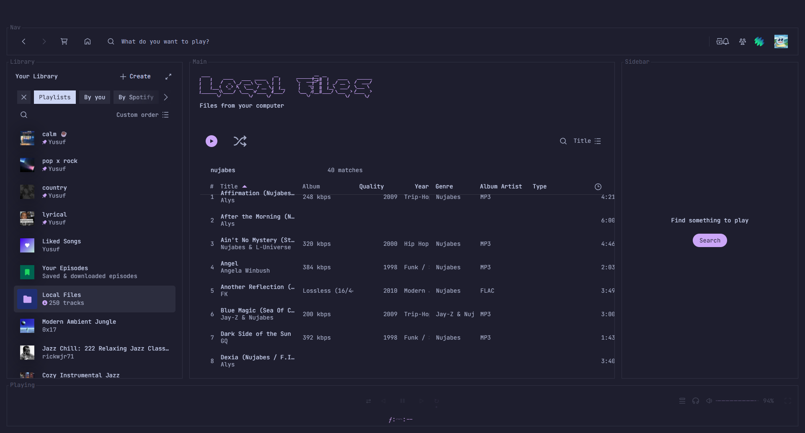

# Local Files+

A [Spicetify](https://spicetify.app/) extension that reads the real tag metadata off
your local audio files — artist, album artist, year, genre, bitrate/quality, and more
— and adds it back into Spotify's **Local Files** page as sortable, filterable
columns.

Spotify's own Local Files view only shows a handful of columns, and its column picker
offers exactly two toggles: Album and Duration. Everything else — album artist, year,
genre, real bitrate, file type, folder — already lives in your files' tags. Local
Files+ reads it and puts it back.



## Features

- **Extra columns**: Quality (bitrate/lossless), Year, Genre, Album Artist, Artist,
  Type, Size, Date Modified, Track #, BPM, Folder — toggle any of them on/off from
  Spotify's own "Change visible columns" popover.
- **Real bitrate**, computed from file size and duration — not guessed.
- **Missing-tag marker** — a small ⚠ next to any track missing album, artist, or
  track number, so you can spot what still needs tagging.
- **Sort** by any extra column — click its header.
- **Filter**, e.g. `flac year:2019 genre:jazz`, `bitrate:>256`, `missing:album`,
  `folder:Nujabes`.

## How it works

Local Files+ asks for one-time read access to your music folder via the browser's
[File System Access API](https://developer.mozilla.org/en-US/docs/Web/API/File_System_API)
— no install, no background process, nothing leaves your machine. It walks the folder,
parses ID3v2 (MP3), Vorbis comments (FLAC), and MP4 atoms (M4A) directly from the file
bytes, caches the result, and matches each parsed file back to the track Spotify
already knows about.

## Install

Via [Spicetify Marketplace](https://github.com/spicetify/marketplace), or manually:

1. Copy `local-files-plus.js` into your Spicetify `Extensions` folder.
2. Add `local-files-plus.js` to the `extensions` line in `config-xpui.ini`.
3. `spicetify apply`.

## Setup

Open the profile menu → **Local Files+** → **Choose music folder**, and pick the same
folder Spotify uses for Local Files. The first scan parses every audio file in it;
later scans only re-parse files that changed.

## Supported formats

Tags are parsed from `.mp3` (ID3v2.2/2.3/2.4, falling back to ID3v1), `.flac`
(Vorbis comments + STREAMINFO for sample rate/bit depth), and `.m4a`/`.mp4` (MP4
atoms). `.ogg`, `.opus`, and `.wav` are indexed (size, type) but not tag-parsed yet.

## Development

No build step — `local-files-plus.js` is the whole extension.

```bash
pnpm test          # node --check local-files-plus.js — syntax gate
pnpm install        # installs husky hooks
```

The tag parsers are pure functions (`ArrayBuffer` in, plain objects out) and run
identically under Node, so they're testable without Spotify — see the
`module.exports` guard at the bottom of the file.

## License

MIT
